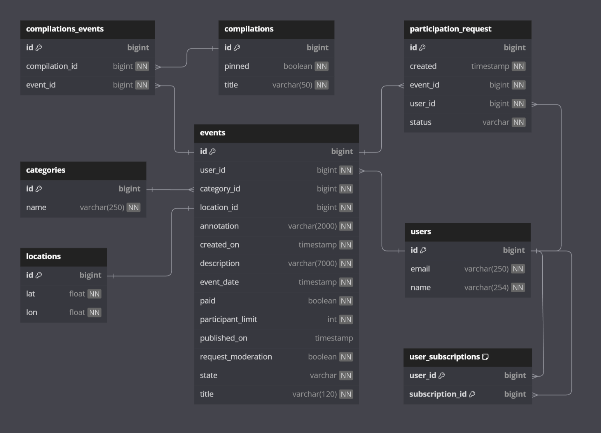

# java-explore-with-me
Simple REST application, written on Java using Spring Boot.  
The application is a poster of events. In this poster you can propose any event from an exhibition to a trip to the cinema and gather a group to participate in it.

## Functional
The main functions are described in the files `ewm-main-service-spec.json` and `ewm-stats-service-spec.json`, which can be opened with [swagger](https://editor.swagger.io/).

## Database structure


### How To Build:

1. Clone the repository
   ```sh
   git clone https://github.com/TinyShroom/java-explore-with-me.git
   ```
2. Configure PostgreSQL
   First, create a database. Then, open src/main/resources/application.properties file and change the spring datasource url, username and password as per your PostgreSQL installation.

3. Build and run tests using
   ```sh
   mvn clean package
   ```

### How To Run:
   ```sh
   docker-compose up
   ```
Main service started on `8080` port and statistics service on `9090`.

